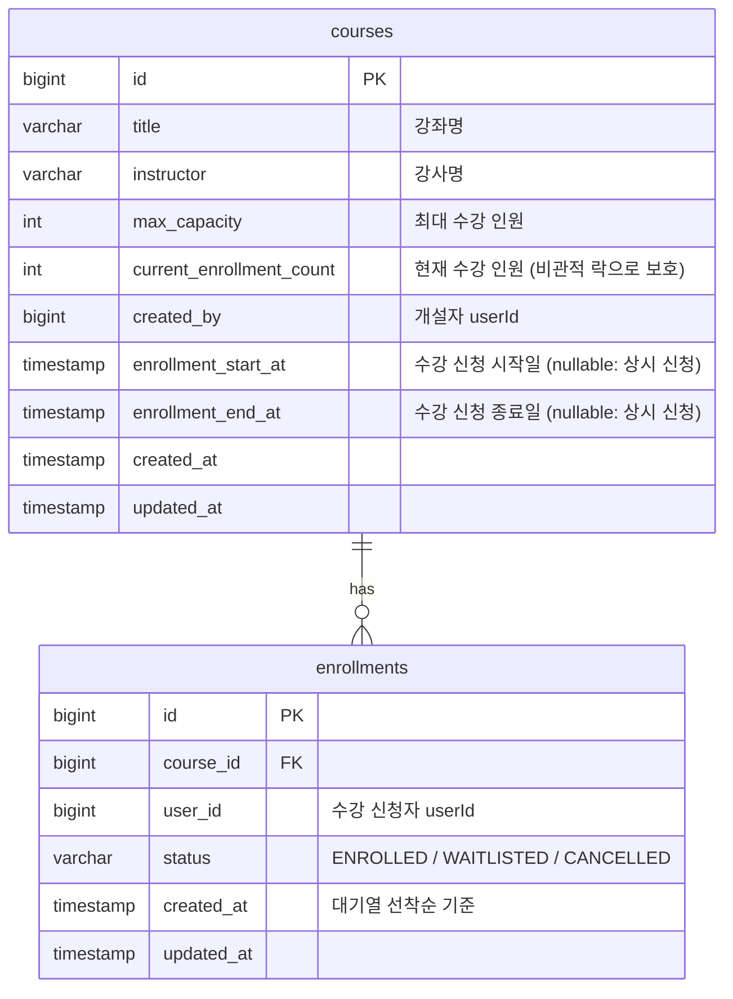

# 실시간 수강 신청 시스템

동시 수강 신청 환경에서 정합성을 보장하고, 정원 초과 시 대기열을 통해 공정한 선착순을 구현한 백엔드 프로젝트입니다.

---

## 프로젝트 개요

| 항목 | 내용 |
|------|------|
| 언어 | Java 17 (Amazon Corretto) |
| 프레임워크 | Spring Boot 3.5 |
| 데이터베이스 | PostgreSQL 16 |
| 빌드 도구 | Gradle 8 |
| 주요 관심사 | 동시성 제어, 대기열, 계층형 아키텍처 |

---

## 기술 스택

| 분류 | 기술 |
|------|------|
| Web | Spring Web MVC |
| Persistence | Spring Data JPA / Hibernate |
| Database | PostgreSQL 16 (Docker) |
| Test | JUnit 5, Mockito, Testcontainers |
| Docs | SpringDoc OpenAPI (Swagger UI) |
| Infra | Docker Compose |

---

## 실행 방법

### 1. PostgreSQL 실행

```bash
docker-compose up -d
```

### 2. 애플리케이션 실행

```bash
./gradlew bootRun
```

### 3. Swagger UI

```
http://localhost:8080/swagger-ui.html
```

### 환경 설정 (`application.yaml`)

```yaml
spring:
  datasource:
    url: jdbc:postgresql://localhost:5432/classdb
    username: admin
    password: admin

enrollment:
  cancel-period-hours: 24  # 수강 취소 가능 기간 (코드 변경 없이 정책 조정 가능)
```

---

## 요구사항 해석 및 가정

| 항목 | 해석 및 가정 |
|------|-------------|
| 인증 | Spring Security 미사용. `X-User-Id` 헤더로 사용자 식별 간소화 |
| 수강 신청 기간 | `enrollmentStartAt` / `enrollmentEndAt` 미설정 시 상시 신청 가능으로 처리 |
| 정원 초과 | 예외 반환 대신 대기열(WAITLISTED) 등록으로 처리 |
| 취소 가능 기간 | 신청 후 24시간 이내로 제한. 외부 설정값으로 관리 |
| 개설자 식별 | 강좌 생성 시 `X-User-Id` 헤더값을 `createdBy`로 저장 |
| User 엔티티 | 과제 범위 내 간소화 — 별도 User 테이블 없이 userId만 사용 |

---

## 설계 결정과 이유

### 1. 비관적 락 (Pessimistic Lock) 선택

수강 신청은 동시 접근이 많고 충돌이 잦은 환경입니다.
낙관적 락(Optimistic Lock)을 사용하면 충돌 시 예외가 발생해 애플리케이션 레벨에서 재시도를 처리해야 합니다.
트래픽이 몰리는 순간에는 재시도가 폭주해 오히려 성능이 악화될 수 있습니다.
비관적 락은 트랜잭션 시작 시 락을 획득해 충돌 자체를 차단하므로, 재시도 없이 정합성을 보장합니다.
`currentEnrollmentCount` 카운터 컬럼을 비관적 락으로 보호해 동시 신청 시에도 정원 초과를 방지합니다.

### 2. 대기열 구현 — EnrollmentStatus에 WAITLISTED 추가

별도 `WaitlistEntry` 엔티티로 분리하는 방식(Option B)도 검토했습니다.
현재 요구사항은 선착순 대기와 취소 시 자동 승급 두 가지입니다.
이 두 가지는 `created_at` 정렬과 상태값 전환만으로 완전히 표현 가능합니다.
별도 엔티티를 추가하면 조인, 트랜잭션 범위 확대, 코드량 증가 등 복잡도가 높아지는데 현재 요구사항에서 그 복잡도를 감수할 이유가 없다고 판단했습니다.
대기열 순위 노출, 만료 정책 같은 요구사항이 생기면 별도 엔티티로 전환하는 기준을 명확히 세워두었습니다.

### 3. SKIP LOCKED — 동시 취소 시 중복 승급 방지

동시에 여러 취소가 발생하면 모든 트랜잭션이 대기열 1번 행을 조회합니다.
`FOR UPDATE`만 사용하면 뒤 트랜잭션이 락 해제를 기다렸다가 이미 승급된 같은 행을 다시 승급시킵니다.
`FOR UPDATE SKIP LOCKED`는 이미 잠긴 행을 건너뛰고 다음 대기자를 선택하기 때문에 중복 승급이 구조적으로 불가능합니다.
`ORDER BY created_at ASC, id ASC`에서 `id`(AUTO_INCREMENT)를 타이브레이커로 추가해 밀리초 단위 동시 등록 시에도 공정한 선착순을 보장합니다.

```sql
SELECT * FROM enrollments
WHERE course_id = :courseId AND status = 'WAITLISTED'
ORDER BY created_at ASC, id ASC
LIMIT 1
FOR UPDATE SKIP LOCKED
```

### 4. 취소 가능 기간 — 외부 설정값으로 관리

취소 가능 기간을 코드에 하드코딩하면 정책이 바뀔 때마다 재배포가 필요합니다.
`application.yaml`의 `enrollment.cancel-period-hours` 값으로 분리해 코드 변경 없이 정책 조정이 가능합니다.

### 5. 개설자 검증 — 도메인 메서드 캡슐화

수강생 목록 조회는 개설자만 접근 가능합니다.
`course.isCreatedBy(userId)` 도메인 메서드로 검증 로직을 엔티티에 캡슐화했습니다.
서비스 레이어에서 한 줄로 의도를 명확하게 표현할 수 있고, 검증 위치가 분산되지 않습니다.

### 6. 4레이어 아키텍처 + DIP

```
presentation → application → domain ← infrastructure
```

도메인 레이어가 인프라 레이어에 의존하지 않도록 Repository 인터페이스를 도메인에 정의하고 구현체를 인프라에 배치했습니다(DIP).
JPA, PostgreSQL 등 구현 기술이 바뀌어도 도메인 로직은 영향을 받지 않습니다.

### 7. H2 미사용 — Testcontainers(PostgreSQL) 선택

동시성 테스트에서 `FOR UPDATE SKIP LOCKED`를 사용하는데 H2는 이를 지원하지 않습니다.
실제 운영 환경과 동일한 PostgreSQL을 Testcontainers로 띄워 테스트해 환경 차이로 인한 버그를 방지합니다.

---

## 미구현 / 제약사항

| 항목 | 내용 |
|------|------|
| 인증/인가 | JWT + Spring Security 미적용. `X-User-Id` 헤더로 간소화 |
| 대기열 최대 인원 | 제한 없음. `maxWaitlistCapacity` 정책 추가로 확장 가능 |
| 승급 알림 | 구현 없음. Kafka / 이메일 이벤트 연동으로 확장 가능 |
| N+1 문제 | `getMyEnrollments()`에서 Enrollment 건마다 Course 조회 발생. JPQL fetch join으로 개선 예정 |
| 기간 이후 승급 | 수강 신청 기간 종료 후 승급 허용. `courseStartAt` 도입 시 강좌 시작 전까지로 제한 가능 |

---

## API 목록 및 예시

### Course API

#### 강좌 생성
```
POST /api/courses
X-User-Id: 1
Content-Type: application/json

{
  "title": "스프링 부트 입문",
  "instructor": "김강사",
  "maxCapacity": 30,
  "enrollmentStartAt": "2026-06-01T09:00:00",
  "enrollmentEndAt": "2026-06-30T18:00:00"
}
```

#### 강좌 단건 조회
```
GET /api/courses/{courseId}
```

#### 강좌 목록 조회 (페이지네이션)
```
GET /api/courses?page=0&size=10&sort=createdAt,desc
```

#### 수강생 목록 조회 (개설자 전용)
```
GET /api/courses/{courseId}/students
X-User-Id: 1
```

---

### Enrollment API

#### 수강 신청
```
POST /api/enrollments
X-User-Id: 100
Content-Type: application/json

{
  "courseId": 1
}
```
- 정원 여유 → `status: ENROLLED`, 메시지: "수강 신청이 완료되었습니다."
- 정원 초과 → `status: WAITLISTED`, 메시지: "대기열에 등록되었습니다."

#### 수강 취소
```
DELETE /api/enrollments/{enrollmentId}
X-User-Id: 100
```
- ENROLLED 취소: 신청 후 24시간 이내만 가능. 취소 시 대기열 선두 자동 승급
- WAITLISTED 취소: 기간 제한 없이 즉시 취소

#### 내 수강 신청 목록
```
GET /api/enrollments/me?page=0&size=10&sort=createdAt,desc
X-User-Id: 100
```

---

## 데이터 모델 설명



### EnrollmentStatus

| 상태 | 설명 |
|------|------|
| `ENROLLED` | 수강 신청 확정 (정원 내) |
| `WAITLISTED` | 대기열 등록 (정원 초과) |
| `CANCELLED` | 취소 완료 |

### 인덱스

| 테이블 | 컬럼 | 목적 |
|--------|------|------|
| enrollments | `user_id` | 내 수강 신청 목록 조회 |
| enrollments | `course_id` | 강좌별 수강생 조회 |

---

## 테스트 실행 방법

### 단위 테스트

```bash
./gradlew test --tests "com.course.classregistration.application.*"
```

### 전체 테스트 (Testcontainers 포함)

Docker가 실행 중인 상태에서:

```bash
./gradlew test
```

### 동시성 테스트

30명이 정원 10명 강좌에 동시 신청하는 시나리오:

```bash
./gradlew test --tests "com.course.classregistration.concurrency.EnrollmentConcurrencyTest"
```

> Testcontainers가 PostgreSQL 컨테이너를 자동으로 띄우므로 별도 DB 설정 불필요

---

## AI 활용 범위

### 본인 직접 수행
- 요구사항 해석 및 이슈 우선순위 결정
- 각 이슈별 구현 방향 최종 결정
  - 비관적 락 vs 낙관적 락 → 수강 신청처럼 충돌이 잦은 환경에서 낙관적 락은 재시도 폭주 위험이 있다고 판단해 비관적 락 선택
  - 대기열 구현 방식 → 현재 요구사항이 선착순 대기와 자동 승급 두 가지뿐이므로 별도 엔티티의 복잡도를 감수할 이유가 없다고 판단, 상태값 추가 방식 선택
  - 기간 이후 승급 허용 → 기간 내에 의사를 표현한 학생이므로 타인의 취소로 기회를 잃는 건 귀책 사유가 없다고 판단
  - 취소 가능 기간 정책 → 코드 변경 없이 정책 변경이 가능하도록 외부 설정값으로 관리
- PR 리뷰 및 머지 결정

### AI 활용 (Claude)
- 선택지별 트레이드오프 분석 및 정리
- 결정된 방향 기반 코드 구현
- 단위 테스트 케이스 작성
- PR 설명 초안 작성
- 트러블슈팅 (한글 주석 패턴 매칭 실패, Testcontainers 접근 제어 등)
